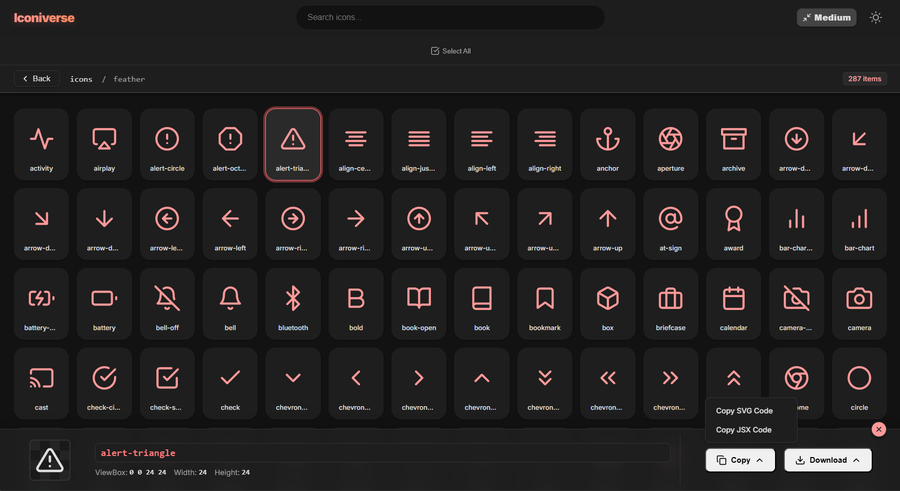

# Iconiverse

A modern, blazing-fast SVG icon viewer and manager designed for developers and designers. Browse, search, and manage your icon collections with a beautiful, responsive interface.



## ✨ Features

- **🚀 Instant Search**: Real-time filtering and global search across all folders.
- **📁 Folder Support**: Organize icons in nested directories with easy navigation.
- **🌓 Dark/Light Mode**: Beautiful themes that respect system preferences.
- **📦 Batch Operations**: Select multiple icons to download as a ZIP archive.
- **📋 Quick Copy**: One-click copy for SVG code or React JSX components.
- **👁️ Live Preview**: Detailed view with dimension and viewBox information.
- **⚡ Static & Dynamic**: Runs as a local Node.js server or a static GitHub Pages site.

## 🎨 Included Icon Packs

- **Feather**
- **Iconoir**
- **Lucide**
- **Tabler**

> **Note:** This is the **Local Version** documentation. For the **Static Version** (GitHub Pages), please see the [Iconiverse-Static](https://github.com/HypnosFD/Iconiverse-Static).

## 🚀 Quick Start

### Prerequisites
- [Node.js](https://nodejs.org/) (v14 or higher)

### Installation

1. **Clone the repository**
   ```bash
   git clone https://github.com/yourusername/iconiverse.git
   cd iconiverse
   ```

2. **Run Setup**
   Double-click `Setup.bat` (Windows) or run:
   ```bash
   npm install
   ```
   *The setup script will automatically install dependencies and create the necessary folder structure.*

3. **Add Your Icons**
   Place your SVG files in the `icons` directory:
   - **`icons/outline/`**: For standard stroked icons.
   - **`icons/filled/`**: For solid/filled icons (ensures correct styling).

4. **Start the Server**
   Double-click `RunServer.bat` or run:
   ```bash
   npm start
   ```
   Open [http://localhost:3000](http://localhost:3000) in your browser.

## 📂 Project Structure

```
iconiverse/
├── icons/              # Your icon collection
│   ├── outline/        # Standard stroked icons
│   └── filled/         # Solid filled icons
├── public/             # Frontend assets (Local version)
├── github/             # Static version for GitHub Pages
├── scripts/            # Build scripts
├── server.js           # Node.js server
└── ...
```

## 🛠️ Technologies

- **Frontend**: Vanilla JavaScript, CSS3 (Variables, Flexbox/Grid), HTML5
- **Backend**: Node.js, Express
- **Tools**: AdmZip (for zipping), Open (for browser launching)

## 📝 License

This project is open source and available under the [MIT License](LICENSE).
